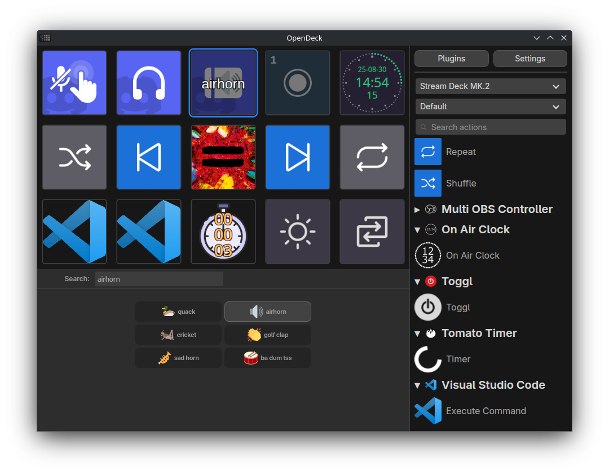
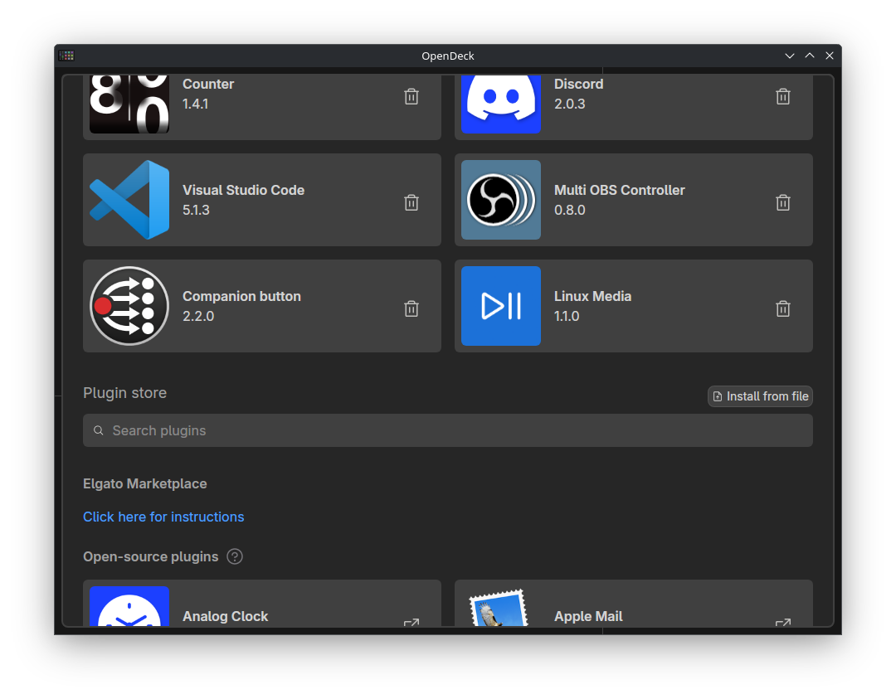
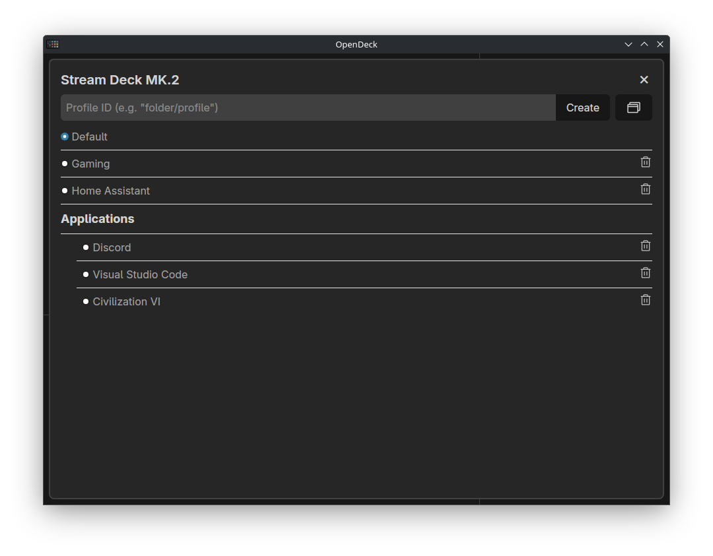

# OpenDeck

OpenDeck is a desktop application for interfacing between human interface devices with keys or encoders and plugins, which provide actions to be carried out when the user interacts with the device. OpenDeck conforms to the [OpenAction](https://openaction.amansprojects.com/) API, which is cross-compatible with the Stream Deck SDK, allowing a wide range of pre-existing plugins to be used.

OpenDeck supports ProntoKey, Elgato Stream Deck and AKP153 (not AKP153e) hardware on all three major desktop platforms. If you would like to contribute support for additional hardware (e.g. Loupedeck) feel free to reach out on any of the support forums and make a pull request!

If you would like to support development of OpenDeck, consider [sponsoring me](https://github.com/sponsors/ninjadev64) on GitHub Sponsors!

Special thanks go to the developers of [Tauri](https://github.com/tauri-apps/tauri), [elgato-streamdeck](https://github.com/streamduck-org/elgato-streamdeck), [Wine](https://www.winehq.org/), and [Phosphor Icons](https://phosphoricons.com/).

## Installation

### GNU+Linux

- Download the latest release from GitHub Releases.
	- You should avoid AppImage releases of OpenDeck as they tend to have problems (you should also just avoid AppImages in general).
	- For users of Arch-based distributions, there is the `opendeck` AUR package for the latest release, as well as the `opendeck-git` AUR package for the latest commit on the `main` branch of this repository.
- Install OpenDeck using your package manager of choice.
- If using Elgato hardware, install the appropriate udev subsystem rules from [here](https://raw.githubusercontent.com/streamduck-org/elgato-streamdeck/main/40-streamdeck.rules):
	- If you're using a `.deb` or `.rpm` release artifact, this file should be installed automatically.
	- Otherwise, download and copy it to the correct location with `sudo cp 40-streamdeck.rules /etc/udev/rules.d/`.
	- In both cases, you will need to reload your udev subsystem rules with `sudo udevadm control --reload-rules`.
- If you intend to use plugins that are only compiled for Windows or macOS (which are the majority of plugins), you will need to have [Wine](https://www.winehq.org/) installed on your system.

### Windows

- Download the latest release (`.exe` or `.msi`) from GitHub Releases.
- Double-click the downloaded file to run the installer.

### macOS

- Download the latest release from GitHub Releases.
- If you downloaded a `.dmg`, open the downloaded disk image and drag the application inside into your Applications folder; otherwise, extract the `.tar.gz` to your Applications folder.
- Open the installed application. Note: if you receive a warning about OpenDeck being distributed by an unknown developer, *right-click the app in Finder and then click Open* to suppress the warning.
- If you intend to use plugins that are only compiled for Windows, you will need to have [Wine](https://www.winehq.org/) installed on your system.

## Showcase

## Support

### How do I...?

To view or modify an action's settings, left-click on it to display its property inspector. To remove an action, right-click on it and choose "Delete" from the context menu.

To edit an action's appearance, right-click on it and select "Edit" in the context menu. You should then be able to customise the image and title of each of its states. To choose an image from your device: left-click on the image, to reset it to the plugin-provided default: right-click on the image, and to remove the image entirely: CTRL+right-click on the image.

To select another device, or to view, switch, modify, import or export profiles, use the dropdowns in the top right corner. You can organise profiles into group-like folders by prefixing the profile name with the folder name and a forward slash.

To enable automatic launch on startup, the light theme, or to change the language plugins are localised in, open Settings. From here, you can also view information about your version of OpenDeck or open the configuration directory. To add or remove plugins, visit the Plugins tab.

### Solutions to frequent problems

- Check the OpenDeck log file for any important messages. This file should be included with any support request.
	- GNU+Linux: `~/config/com.amansprojects.opendeck/logs/`
	- Windows: `%appdata%/com.amansprojects.opendeck/logs`
	- macOS: `~/Library/Application Support/com.amansprojects.opendeck/logs`
- When trying to run Windows-only plugins (which are the majority of plugins) on GNU+Linux or macOS, please ensure you have the latest version of Wine installed on your system.
- If your device isn't showing up, ensure you have the correct permissions to access it, and that you have restarted OpenDeck since connecting it.

### Support forums

- [Discord](https://discord.gg/26Nf8rHvaj)
- [Matrix](https://matrix.to/#/#opendeck:amansprojects.com)
- [GitHub Issues](https://github.com/ninjadev64/OpenDeck/issues)

### Building from source / contributing

You'll need to ensure that all of the [prerequisites for building a Tauri application](https://tauri.app/v1/guides/getting-started/prerequisites) are satisfied to build OpenDeck (this includes the Tauri CLI from `cargo install tauri-cli`), as well as [Deno](https://deno.com/). On GNU+Linux, you'll also need `libudev` installed for your distribution. You can then use `cargo tauri dev` and `cargo tauri build` to work with OpenDeck.

When submitting a pull request, ensure that all of your Rust code has been formatted using `cargo fmt`, `cargo clippy` returns no violations, `deno task check` returns no violations, and modified Svelte code sticks to the existing style used as far as possible. Feel free to reach out on the support channels above for guidance when contributing!

OpenDeck is licensed under the MIT license.
